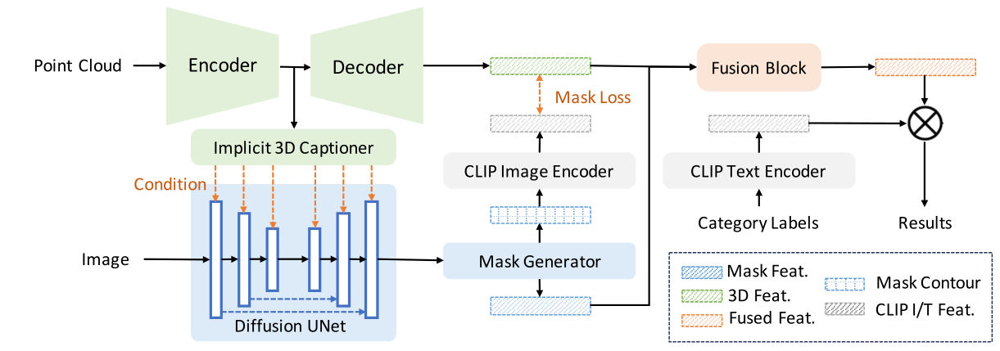

# XMask3D: Cross-modal Mask Reasoning for Open Vocabulary 3D Semantic Segmentation

Created by [Ziyi Wang*](https://wangzy22.github.io/), [Yanbo Wang*](https://Yanbo-23.github.io/), [Xumin Yu](https://yuxumin.github.io/), [Jie Zhou](https://scholar.google.com/citations?user=6a79aPwAAAAJ&hl=en&authuser=1), [Jiwen Lu](https://scholar.google.com/citations?user=TN8uDQoAAAAJ&hl=zh-CN).


This repository is a pyTorch implementation of our NeurIPS 2024 paper **XMask3D**.

XMask3D is a framework for open vocabulary 3D semantic segmentation that improves fine-grained boundary delineation by aligning 3D features with a 2D-text embedding space at the mask level. Using a mask generator based on a pre-trained diffusion model, it enables precise textual control over dense pixel representations, enhancing the versatility of generated masks. By integrating 3D global features into a 2D denoising UNet, XMask3D adds 3D geometry awareness to mask generation. The resulting 2D masks align 3D representations with vision-language features, yielding competitive segmentation performance across benchmarks.

[[arXiv]()][[Project Page]()]



## Installation
Follow the [installation.md](installation.md) to install all required packages so you can do the training & evaluation afterwards.

## Data Preparation

- For convenience, the download link for the processed dataset is provided here. You can download the dataset by executing the command below.
```bash
sh scripts/download_datasets.sh
```

## Checkpoint

| **Benchmark**         | **hIoU / mIoU<sub>b</sub> / mIoU<sub>n</sub>** | **Download Link**       |
|-----------------------|-----------------------------------------------|--------------------------|
| **Scannet B15N4**     | 70.0 / 69.8 / 70.2                            | [Download Link](#)       |
| **Scannet B12N7**     | 61.7 / 70.2 / 55.1                            | [Download Link](#)       |
| **Scannet B10N9**     | 55.7 / 76.5 / 43.8                            | [Download Link](#)       |
| **Scannet B170N30**   | 18.0 / 27.8 / 13.3                            | [Download Link](#)       |
| **Scannet B150N50**   | 15.5 / 24.4 / 11.4                            | [Download Link](#)       |

